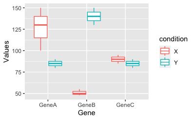

# Coding exercises

Please complete the following 4 exercises. You can use different programming languages for different exercises. Solve each problem within the correct sub folder. Once finished push your solutions to github. 

## Problem 1

One of the PIs asks you to recreate a figure they saw in a publication:



The data is given to you in a comma separated file:

```
Gene,SampleX1,SampleX2,SampleX3,SampleY1,SampleY2,SampleY3
GeneA,100,150,130,80,90,85
GeneB,50,48,55,140,150,130
GeneC,90,85,95,90,85,80

```

There are two conditions X and Y with three replicates each. The rows show hypothetical measurement for three genes. 

## Problem 2

### 2A - serialization

The goal is to serialize a field i.e. take something like this...
```
Tissue    Sample
Blood     GTEX-N7MS-0007-SM-26GME
Blood     GTEX-N7MS-0007-SM-26GMV
Blood     GTEX-N7MS-0007-SM-2D43E
Skin      GTEX-N7MS-0007-SM-2D7W1
Skin      GTEX-N7MS-0008-SM-4E3JI
```

...and turn it into this

```
Tissue   Sample
Blood    GTEX-N7MS-0007-SM-26GME, GTEX-N7MS-0007-SM-26GMV, GTEX-N7MS-0007-SM-2D43E
Skin     GTEX-N7MS-0007-SM-2D7W1, GTEX-N7MS-0008-SM-4E3JI
```

Find the input file in the Problem_2 folder.

### 2B - deserialization

The goal is to deserialize a field i.e. convert this
```
Tissue                 Sample
adipose_tissue_omental GSM80561,GSM80562,GSM80563,GSM80564
amygdala               GSM80565,GSM80566
```

...to this

```
Tissue                 Sample
adipose_tissue_omental GSM80561
adipose_tissue_omental GSM80562
adipose_tissue_omental GSM80563
adipose_tissue_omental GSM80564
amygdala               GSM80565
amygdala               GSM80566
```

Please find the tab delimited input file in the Problem_2 folder.

## Problem 3

Examine if there was a GC bias in the fastq file in the Problem_3 folder. Ignore bases that are *N*. Example:

```
@read1
NCCGGAGCCGGTCG
+
#<BBBFFFFFFFFF
@read2
GGTCCGCCGGCCCT
+
BBBBBFBFFFFFFF
```

Would result in (Please round the percentage to 1 digit):

```
All bases 27
GC bases 23
Percent GC 85.2%
```

## Problem 4

Add chr to chromosomes column in the input vcf. Bonus: use sed/awk one liners. 

Turn this:

```
...
##FORMAT=<ID=CNQ,Number=1,Type=Float,Description="Copy number genotype quality for imprecise events">
#CHROM  POS   ID  REF ALT   QUAL  FILTER  INFO  FORMAT  NA00001
1 2827693   . CCGTGGATGCGGGGACCCGCATCCCCTCTCCCTTCACAGCTGAGTGACCCACATCCCCTCTCCCCTCGCA  C . PASS  SVTYPE=DEL;END=2827680;BKPTID=Pindel_LCS_D1099159;HOMLEN=1;HOMSEQ=C;SVLEN=-66 GT:GQ 1/1:13.9
...
```

Into this:

```
...
##FORMAT=<ID=CNQ,Number=1,Type=Float,Description="Copy number genotype quality for imprecise events">
#CHROM  POS   ID  REF ALT   QUAL  FILTER  INFO  FORMAT  NA00001
chr1 2827693   . CCGTGGATGCGGGGACCCGCATCCCCTCTCCCTTCACAGCTGAGTGACCCACATCCCCTCTCCCCTCGCA  C . PASS  SVTYPE=DEL;END=2827680;BKPTID=Pindel_LCS_D1099159;HOMLEN=1;HOMSEQ=C;SVLEN=-66 GT:GQ 1/1:13.9
...
```
